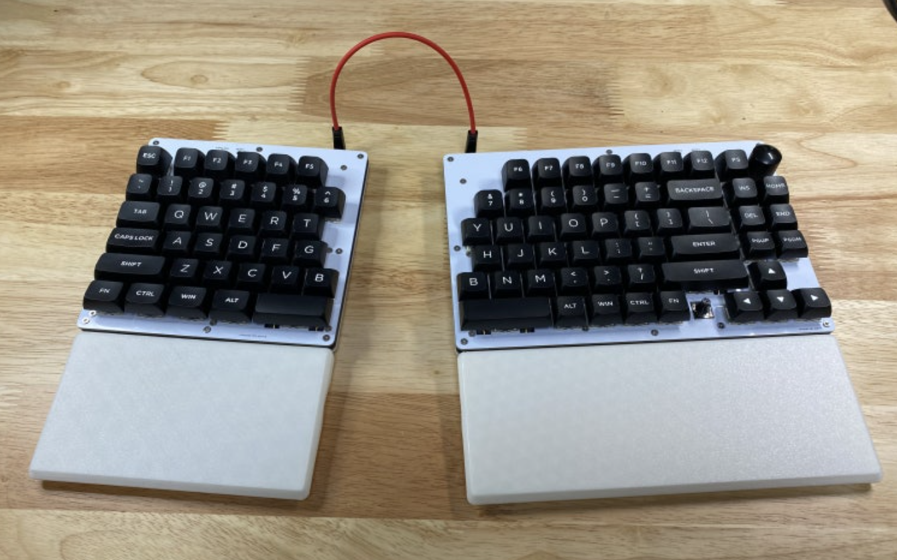

# krsplit P213

An RP2040-based split custom keyboard from the krsplit series, connected over wired USB-C. It's a column/row-staggered split board designed around an ANSI 107-key layout, with a rotary encoder and an analog joystick (pointing device) on the right half, letting you move the cursor and scroll without a separate mouse.

* Keyboard Maintainer: [kesaros44](https://github.com/kesaros44)
* Hardware Supported: RP2040 (Raspberry Pi RP2040), one PCB per half (left/right)
* Hardware Availability: personal custom PCB (not publicly distributed)

## Hardware

* **MCU:** RP2040 (ARM Cortex-M0+), UF2 bootloader
* **Matrix:** 12 rows x 10 cols (6 rows used per half), `COL2ROW` diode direction
* **Split communication:** soft serial (`GP1`); `SPLIT_USB_DETECT` lets either half become master depending on which side USB is plugged into; `SPLIT_HAND_PIN` (`GP3`) determines left/right handedness
* **Rotary encoder:** one, on the right half only (`GP16`/`GP17`). The left half has the position reserved (`NO_PIN`) but no physical encoder — this keeps the left/right pin indices aligned
* **Backlight:** PWM-driven (`GP28`), 7 brightness levels, breathing effect supported (6-second cycle)
* **RGB underglow:** WS2812, 4 LEDs total (2 per half, `GP29`)
* **Pointing device:** analog joystick (X: `GP26`, Y: `GP27`) — moving the joystick automatically switches to a dedicated mouse layer (auto-reverts after 350ms of inactivity), with custom logic that switches to scroll mode past a certain tilt angle
* **Entering the bootloader:** double-tap the reset button (standard RP2040 UF2 method); the `GP17` LED indicates bootloader mode

## Software Features

* 4 layers: a Windows base layer, a Mac base layer (Cmd/Opt swapped), an Fn layer (backlight/RGB controls), and a Mouse layer (entered automatically when the joystick is used)
* Built-in autocorrection (QMK community feature, with its own dictionary data)
* Split into two builds — see `BUILD_AND_VIAL_GUIDE.txt` for the exact build commands:
  * `keymaps/default` — plain QMK build (no VIA/Vial)
  * `keymaps/vial` — built with [Vial](https://get.vial.today/) support, so keymaps/macros/combos can be edited live without recompiling firmware (must be built against the [vial-kb/vial-qmk](https://github.com/vial-kb/vial-qmk) fork — it will not build against mainline QMK)

## Important Notes (issues found firsthand)

* **The keyboard definition file must be named `keyboard.json`.** The older name, `info.json`, is no longer recognized by current QMK at all — the build simply ignores it.
* **A keyboard-level C source file is only auto-included in the build if it's named exactly after its own folder.** For this board that means `p213.c`, not `krsplit.c` — if the name doesn't match, the build can appear to succeed while silently dropping everything in that file (autocorrection wiring, RGB state sync, EEPROM init logic, etc.) with no compile error. Always double-check the filename.
* Encoder pins use the current macro names (`ENCODER_A_PINS`/`ENCODER_B_PINS`(`_RIGHT`)) — the old names (`ENCODERS_PAD_A`/`ENCODERS_PAD_B`) collide with current QMK's auto-generated code and cause a compile error.
* The keymap uses current keycode names for mouse buttons and underglow: `MS_BTN1`/`MS_BTN2` (formerly `KC_MS_BTN1`/`KC_MS_BTN2`), `UG_TOGG`/`UG_NEXT`/`UG_HUEU`/`UG_HUED`/`UG_VALU`/`UG_VALD` (formerly `RGB_TOG`/`RGB_MOD`/`RGB_HUI`/`RGB_HUD`/`RGB_VAI`/`RGB_VAD`).
* The Vial build has `VIAL_INSECURE = yes` set, so the keymap can be edited immediately with no unlock combo needed (remove this and switch to an unlock-combo scheme if security against loss/theft matters to you).
* **`NO_SUSPEND_POWER_DOWN` is set in `config.h`.** By default, QMK turns the backlight off the instant the host suspends the USB connection and snaps it back to full brightness — with no fade — the instant it wakes up; if the host's USB power management periodically suspends an idle keyboard, this shows up as a visible backlight flash every few minutes. Since this is a wired keyboard with no battery to save, there's no real benefit to powering down on suspend, so this behavior is disabled outright.
* RP2040 has plenty of flash (2MB) and EEPROM headroom (via wear-leveling), so Vial's Tap Dance, Combos, Key Overrides, and Mouse Keys can all stay enabled without running into space constraints (unlike the ATmega32U4-based V213 board, where several of these had to be disabled to fit).

Make example for this keyboard (after setting up your build environment):

    make krsplit/p213:default

Flashing: RP2040 doesn't need QMK Toolbox. After entering the bootloader, the board mounts as an `RPI-RP2` drive — just drag and drop the built `.uf2` file onto it, and it reboots and applies the firmware automatically.

See the [build environment setup](https://docs.qmk.fm/#/getting_started_build_tools) and the [make instructions](https://docs.qmk.fm/#/getting_started_make_guide) for more information. Brand new to QMK? Start with our [Complete Newbs Guide](https://docs.qmk.fm/#/newbs).

## Bootloader

Enter the bootloader in 3 ways:

* **Bootmagic reset**: Hold down the key at (0,0) in the matrix (usually the top left key or Escape) and plug in the keyboard
* **Physical reset button**: double-tap the reset button quickly — the standard way to enter the RP2040's UF2 bootloader
* **Keycode in layout**: Press the key mapped to `QK_BOOT` if it is available

---

# krsplit P213 (한글)

krsplit 시리즈의 RP2040 기반 스플릿 커스텀 키보드로, 유선 USB-C로 연결합니다. ANSI 107키 레이아웃을 기준으로 설계된 컬럼/로우 스태거드 스플릿 보드이며, 우측 절반에 로터리 엔코더와 아날로그 조이스틱(포인팅 디바이스)이 있어 별도의 마우스 없이 커서 이동과 스크롤이 가능합니다.

* 키보드 유지보수자: [kesaros44](https://github.com/kesaros44)
* 지원 하드웨어: RP2040 (Raspberry Pi RP2040), 좌/우 절반당 각각 1개의 PCB
* 하드웨어 구입처: 개인 커스텀 PCB (공개 배포 안 함)

## 하드웨어

* **MCU:** RP2040 (ARM Cortex-M0+), UF2 부트로더
* **매트릭스:** 12행 x 10열 (절반당 6행 사용), `COL2ROW` 다이오드 방향
* **스플릿 통신:** 소프트 시리얼(`GP1`); `SPLIT_USB_DETECT`로 USB가 꽂힌 쪽이 마스터가 됨; `SPLIT_HAND_PIN`(`GP3`)으로 좌/우 핸디드니스 결정
* **로터리 엔코더:** 1개, 우측 절반에만 존재(`GP16`/`GP17`). 좌측에는 자리만 예약되어 있고(`NO_PIN`) 실제 엔코더는 없음 — 좌/우 핀 인덱스를 맞추기 위한 설계
* **백라이트:** PWM 구동(`GP28`), 밝기 7단계, 브리딩 효과 지원(6초 주기)
* **RGB 언더글로우:** WS2812, 총 4개 LED(절반당 2개, `GP29`)
* **포인팅 디바이스:** 아날로그 조이스틱(X: `GP26`, Y: `GP27`) — 조이스틱을 움직이면 자동으로 전용 마우스 레이어로 전환됨(350ms 동안 입력이 없으면 자동 복귀), 일정 기울기 이상에서는 스크롤 모드로 전환하는 커스텀 로직 포함
* **부트로더 진입:** 리셋 버튼 더블탭(RP2040 UF2 표준 방식); `GP17` LED가 부트로더 모드를 표시

## 소프트웨어 기능

* 4개 레이어: Windows 베이스 레이어, Mac 베이스 레이어(Cmd/Opt 위치 교체), Fn 레이어(백라이트/RGB 컨트롤), 조이스틱 사용 시 자동 진입하는 마우스 레이어
* 내장 자동 오타 수정(QMK 커뮤니티 기능, 자체 사전 데이터 포함)
* 두 가지 빌드로 분리되어 있음 — 정확한 빌드 명령어는 `BUILD_AND_VIAL_GUIDE.txt` 참고:
  * `keymaps/default` — 순정 QMK 빌드 (VIA/Vial 없음)
  * `keymaps/vial` — [Vial](https://get.vial.today/) 지원 빌드, 펌웨어 재컴파일 없이 키맵/매크로/콤보를 실시간으로 편집 가능([vial-kb/vial-qmk](https://github.com/vial-kb/vial-qmk) 포크로만 빌드해야 하며, mainline QMK로는 빌드되지 않음)

## 중요 참고사항 (직접 발견한 문제들)

* **키보드 정의 파일 이름은 반드시 `keyboard.json`이어야 합니다.** 예전 이름인 `info.json`은 현재 QMK가 전혀 인식하지 않으며, 빌드 과정에서 그냥 무시됩니다.
* **키보드 레벨 C 소스 파일은 자신이 속한 폴더 이름과 정확히 일치할 때만 빌드에 자동 포함됩니다.** 이 보드의 경우 `krsplit.c`가 아니라 `p213.c`여야 합니다 — 이름이 일치하지 않으면 컴파일 오류 없이 그 파일 안의 모든 내용(자동 오타 수정 연결, RGB 상태 동기화, EEPROM 초기화 로직 등)이 조용히 빌드에서 빠진 채로 빌드가 성공한 것처럼 보일 수 있습니다. 항상 파일명을 확인하세요.
* 엔코더 핀은 현재 매크로 이름(`ENCODER_A_PINS`/`ENCODER_B_PINS`(`_RIGHT`))을 사용합니다 — 옛 이름(`ENCODERS_PAD_A`/`ENCODERS_PAD_B`)은 최신 QMK의 자동 생성 코드와 충돌해 컴파일 오류를 일으킵니다.
* 키맵은 마우스 버튼과 언더글로우에 현재 키코드 이름을 사용합니다: `MS_BTN1`/`MS_BTN2`(예전 이름 `KC_MS_BTN1`/`KC_MS_BTN2`), `UG_TOGG`/`UG_NEXT`/`UG_HUEU`/`UG_HUED`/`UG_VALU`/`UG_VALD`(예전 이름 `RGB_TOG`/`RGB_MOD`/`RGB_HUI`/`RGB_HUD`/`RGB_VAI`/`RGB_VAD`).
* Vial 빌드는 `VIAL_INSECURE = yes`로 설정되어 있어 언락 콤보 없이 바로 키맵을 편집할 수 있습니다(분실/도난에 대한 보안이 중요하다면 이 옵션을 제거하고 언락 콤보 방식으로 전환하세요).
* **`config.h`에 `NO_SUSPEND_POWER_DOWN`이 설정되어 있습니다.** QMK는 기본적으로 호스트가 USB 연결을 서스펜드하는 즉시 백라이트를 끄고, 다시 깨어나는 즉시 페이드 없이 최대 밝기로 복원합니다. 호스트의 USB 전원 관리가 유휴 키보드를 주기적으로 서스펜드한다면 몇 분마다 백라이트가 깜빡이는 현상이 나타날 수 있습니다. 이 보드는 배터리를 아낄 필요가 없는 유선 키보드이므로 서스펜드 시 전원을 내려서 얻는 실질적 이점이 없어, 이 동작을 아예 비활성화했습니다.
* RP2040은 플래시(2MB)와 EEPROM(웨어 레벨링 방식) 여유가 넉넉해서, ATmega32U4 기반의 V213 보드에서는 여러 기능을 꺼야 했던 것과 달리 Vial의 탭댄스/콤보/키 오버라이드/마우스키를 공간 제약 없이 모두 켜둘 수 있습니다.

빌드 환경을 갖춘 뒤 이 키보드에 대한 make 예시:

    make krsplit/p213:default

플래싱: RP2040은 QMK Toolbox가 필요 없습니다. 부트로더에 진입하면 보드가 `RPI-RP2`라는 드라이브로 마운트되며, 빌드된 `.uf2` 파일을 그 드라이브에 드래그 앤 드롭하면 자동으로 재부팅되며 펌웨어가 적용됩니다.

자세한 내용은 [빌드 환경 설정](https://docs.qmk.fm/#/getting_started_build_tools)과 [make 사용법](https://docs.qmk.fm/#/getting_started_make_guide)을 참고하세요. QMK가 처음이라면 [완전 초보자 가이드](https://docs.qmk.fm/#/newbs)부터 시작하세요.

## 부트로더

부트로더 진입 방법은 3가지입니다:

* **부트매직 리셋**: 매트릭스의 (0,0) 위치 키(보통 좌상단 키나 Esc)를 누른 채로 키보드를 연결
* **물리 리셋 버튼**: 리셋 버튼을 빠르게 두 번 누름 — RP2040 UF2 부트로더 진입의 표준 방식
* **레이아웃 안의 키코드**: `QK_BOOT`가 매핑되어 있다면 그 키를 누름
